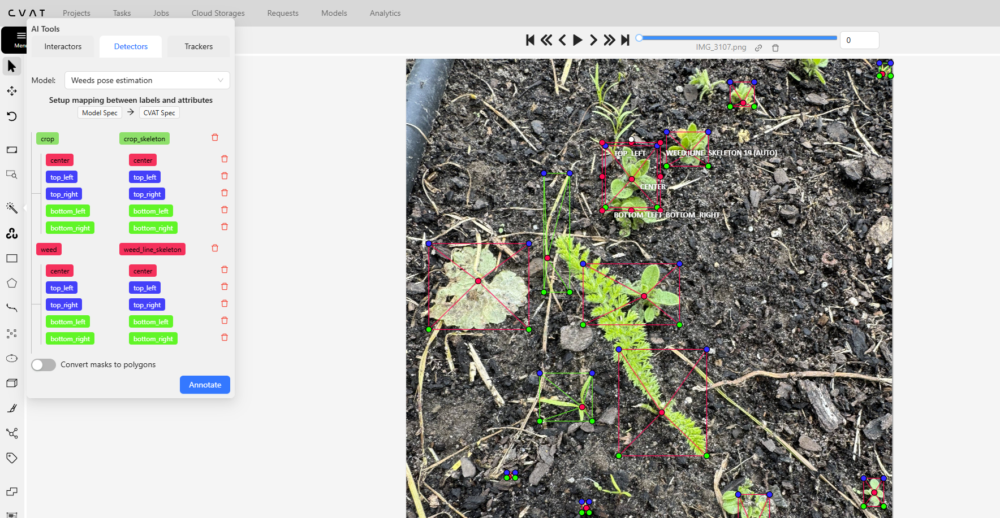

# CVAT automatic annotation with YOLOv8 pose model

## 1. Install CVAT
In order to enable serverless functions in CVAT, we need to launch CVAT as follows
```bash
git clone https://github.com/opencv/cvat.git
cd cvat
git checkout bs/fixed_skeleton_upload
docker compose -f docker-compose.yml -f components/serverless/docker-compose.serverless.yml up -d
```
Afterwards, we need to install nuclio to enable serverless functions in CVAT. This was tested with version 1.13.0.
```bash
wget https://github.com/nuclio/nuclio/releases/download/1.13.0/nuctl-1.13.0-linux-amd64
sudo chmod +x nuctl-1.13.0-linux-amd64
sudo ln -sf $(pwd)/nuctl-<version>-linux-amd64 /usr/local/bin/nuctl
```
Now that nuclio has been setup, we need to create a new project in CVAT as follows:
```bash
nuctl create project cvat
```
To verify that the project has been created, we can open the browser and navigate to the Nuclio dashboard at http://localhost:8070/ and there should be a project called `cvat` with no functions so far. 

## 3. Install YOLOv8 pose model

Now we need to clone this repository into the serverless functions folder of CVAT and use the deploy_cpu.sh script to deploy the YOLOv8 pose model. The helper script is provided by the CVAT team and has all the necessary information to deploy the model.
```bash
cd cvat/serverless/
git clone git@github.com:LALWeco/weed_pose_annotator.git
./deploy_cpu.sh weed_pose_annotator/yolov8pose/nuclio
```

## 4. Testing the model
Assuming that the model has been deployed successfully, we can test it using the magic wand tool in CVAT and select the `Weeds Pose Estimation` function in the `Detectors` tab.
You can map the crop and weed classes to the appropriate classes and if the skeletons match with the config file as shown in the screenshot below, the keypoints will be matched automatically. Once the mapping has been done, you can click on the `Annotate` button to annotate the current frame.


